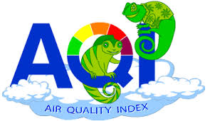

## Repository Overview
This repository is about different Machine Learning algorithm approaches as per the industry practices.

## Table of Contents
- [Air Quality Index (EDA)](#section1) 
- [Car Dekho EDA and Prediction](#section2) 
- [Telecom Churn Prediction](#section3) 
- [HR Prediction for Promotion](#section4) 

___

### [Air Quality Index](./Air_Quality_Index)
  
- Air pollution has been a global problem now a days. Many countries are suffering from 
polluted air and global warming due to bad air quality. 
- The Air Quality  in atmosphere determines various human and environmental factors which
Directly or indirectly effects livings on earth.
- The air quality effects Temperature and Humidity (Absolute and Relative) both causing 
Problem to surroundings.
- This study we will find the relation between various air quality factors, their effect and 
mitigation aspects.
- [Link for the Jupyter notebook](./Air_Quality_Index/AirQuality_Analysis.ipynb)
- [Link for the Presentation](./Air_Quality_Index/AirQualityIndex_EDA_Presentation.pptx)
___

### [Car Dekho EDA and Prediction](./Car_Dekho_EDA_and_Prediction)
  

- CarDekho.com is India's leading car search venture that helps users buy cars that are right
for them. Its website and app carry rich automotive content such as expert reviews, 
detailed specs and prices, comparisons as well as videos and pictures of all car brands and 
models available in India. The company has tie-ups with many auto manufacturers, more 
than 4000 car dealers and numerous financial institutions to facilitate the purchase of 
vehicles.
- This study is done based on the data taken from Car Dekho company and the objective of 
this study is to create a predictive model to predict Selling price of a car based on various 
features like Make, Model, Distance driven, Manual or Automatic like many other features.

- [Link for the Jupyter notebook](./Car_Dekho_EDA_and_Prediction/Car_Dekho_EDA_and_prediction.ipynb)
- [Link for the Presentation](./Car_Dekho_EDA_and_Prediction/CarDekhoSellingPrice_EDA__Modeling_Presentation.pptx)
- [Link for the Video Presentation](./Car_Dekho_EDA_and_Prediction/CarDekho_Video_Presentation.mp4)
___

### [Telecom Churn Prediction](./Telecom-Churn-Analysis)
  

- A churn with respect to the Telecom industry, is defined as the percentage of __subscribers moving__ from a specific service to a service provider to another in a period of time.
- Research shows that the companies have an __avergae churn of 1.9 to 2 percent__ month on month and annualized churn ranging from 10 to 60 percent.
- An effort to build a model which helps in reducing the churn rate for a telecom company.
- [Link for the Jupyter notebook](./Telecom-Churn-Analysis/Telecom_Churn_analysis.ipynb)

___

### [HR Prediction for Promotion](./AnalyticsVidhya_HR_Prediction)
  

- An HR in company plays various roles for growth of Organization and individual both.
- The key aspect is employee satisfaction and fair promotion
- There are many aspects which contribute to promotion like Age, Academics Background, Competencies etc.
- This prediction used few of the features like this and helps HRs to get a fair knowledge whether the individual with given aspects deserves promotion or not.

- [Link for the Jupyter notebook](./AnalyticsVidhya_HR_Prediction/HR_Prediction.ipynb)
